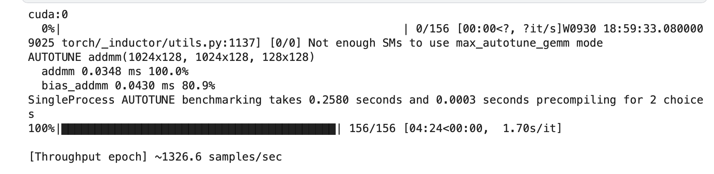

# Инструменты для профайлинга

Для профайлинга модели в `profiling.py` сделано несколько утилит:

- **ThroughputMeter** — счётчик пропускной способности (samples/sec).
- **make_profiler** — удобное создание профайлера.
- **print_top_tables** — удобный вывод топ-операторов по CPU/GPU времени.
- **export_trace** — сохранение трейсов
- **marked** — для собственных аннотаций для наглядности в трейсах.

# Результаты профайлинга

Вот краткие результаты профайлинга базовой модели:
- [Throughput during profiled window] ~4.9 samples/sec
- Self CPU time total: 29.238s (время всего оверхеда на CPU)
- Self CUDA time total: 28.157s (время GPU затрачено ядрами)
Основные проблемы:
- **aten::mul** — занимает ~64% времени на GPU. Вызвано  раздуванием тензоров и дальнейшей работе с ними.  
- **aten::copy_** — большое количество копирований тензоров из-за использования repeat и permute.  


<details>
  <summary><b>Логи</b></summary>

  
```

[W927 17:55:25.665631335 CPUAllocator.cpp:245] Memory block of unknown size was allocated before the profiling started, profiler results will not include the deallocation event

==== TOP CUDA ops (self_cuda_time_total) ====
-------------------------------------------------------  ------------  ------------  ------------  ------------  ------------  ------------  ------------  ------------  ------------  ------------  ------------  ------------  ------------  ------------  
                                                   Name    Self CPU %      Self CPU   CPU total %     CPU total  CPU time avg     Self CUDA   Self CUDA %    CUDA total  CUDA time avg       CPU Mem  Self CPU Mem      CUDA Mem  Self CUDA Mem    # of Calls  
-------------------------------------------------------  ------------  ------------  ------------  ------------  ------------  ------------  ------------  ------------  ------------  ------------  ------------  ------------  ------------  ------------  
                                                forward         0.00%       0.000us         0.00%       0.000us       0.000us       19.582s        69.54%       19.582s     391.632ms           0 b           0 b           0 b           0 b            50  
void at::native::elementwise_kernel<128, 2, at::nati...         0.00%       0.000us         0.00%       0.000us       0.000us       18.006s        63.95%       18.006s       7.422ms           0 b           0 b           0 b           0 b          2426  
                                              aten::mul         0.16%      46.703ms         0.24%      71.106ms      23.702us       17.980s        63.86%       17.980s       5.993ms           0 b           0 b     436.30 Gb     436.30 Gb          3000  
void at::native::elementwise_kernel<128, 2, at::nati...         0.00%       0.000us         0.00%       0.000us       0.000us        3.253s        11.55%        3.253s       1.319ms           0 b           0 b           0 b           0 b          2467  
                                            aten::copy_         0.08%      22.872ms        89.78%       26.251s      15.442ms        2.545s         9.04%        2.545s       1.497ms           0 b           0 b           0 b           0 b          1700  
                                              aten::sum         0.29%      84.059ms         0.43%     125.482ms      29.525us        2.435s         8.65%        2.435s     572.930us           0 b           0 b       2.85 Gb       2.85 Gb          4250  
                                            aten::addmm         0.26%      75.485ms         0.36%     105.179ms      70.119us        2.083s         7.40%        2.083s       1.388ms           0 b           0 b     144.29 Gb     143.70 Gb          1500  
void at::native::reduce_kernel<128, 4, at::native::R...         0.00%       0.000us         0.00%       0.000us       0.000us        1.845s         6.55%        1.845s     595.583us           0 b           0 b           0 b           0 b          3097  
                                   volta_sgemm_64x64_nn         0.00%       0.000us         0.00%       0.000us       0.000us        1.445s         5.13%        1.445s       2.385ms           0 b           0 b           0 b           0 b           606  
                                               aten::mm         0.25%      74.071ms         0.36%     105.536ms      35.179us        1.325s         4.70%        1.325s     441.501us           0 b           0 b       1.66 Gb       1.66 Gb          3000  
                                              aten::add         0.11%      33.205ms         0.17%      48.861ms      26.411us        1.317s         4.68%        1.317s     711.754us           0 b           0 b     146.71 Gb     146.71 Gb          1850  
void at::native::elementwise_kernel<128, 2, at::nati...         0.00%       0.000us         0.00%       0.000us       0.000us        1.304s         4.63%        1.304s       1.525ms           0 b           0 b           0 b           0 b           855  
std::enable_if<!(false), void>::type internal::gemvx...         0.00%       0.000us         0.00%       0.000us       0.000us     690.322ms         2.45%     690.322ms       2.256ms           0 b           0 b           0 b           0 b           306  
void gemv2N_kernel<int, int, float, float, float, fl...         0.00%       0.000us         0.00%       0.000us       0.000us     637.349ms         2.26%     637.349ms       2.083ms           0 b           0 b           0 b           0 b           306  
void at::native::reduce_kernel<512, 1, at::native::R...         0.00%       0.000us         0.00%       0.000us       0.000us     622.864ms         2.21%     622.864ms     510.544us           0 b           0 b           0 b           0 b          1220  
                       aten::native_layer_norm_backward         0.09%      26.662ms         0.30%      87.248ms      72.707us      84.521ms         0.30%     100.479ms      83.733us           0 b           0 b       2.46 Gb      -1.27 Gb          1200  
                                              aten::bmm         0.08%      23.627ms         0.11%      31.438ms      34.931us      81.407ms         0.29%      81.407ms      90.452us           0 b           0 b       2.44 Gb       2.44 Gb           900  
                                aten::native_layer_norm         0.11%      33.520ms         0.25%      71.771ms      59.809us      55.091ms         0.20%      55.174ms      45.978us           0 b           0 b       2.44 Gb           0 b          1200  
void at::native::(anonymous namespace)::vectorized_l...         0.00%       0.000us         0.00%       0.000us       0.000us      55.091ms         0.20%      55.091ms      45.909us           0 b           0 b           0 b           0 b          1200  
                              Optimizer.step#AdamW.step         0.00%       0.000us         0.00%       0.000us       0.000us      47.003ms         0.17%      47.003ms     940.056us           0 b           0 b           0 b           0 b            50  
void at::native::(anonymous namespace)::GammaBetaBac...         0.00%       0.000us         0.00%       0.000us       0.000us      43.623ms         0.15%      43.623ms      47.519us           0 b           0 b           0 b           0 b           918  
void at::native::(anonymous namespace)::layer_norm_g...         0.00%       0.000us         0.00%       0.000us       0.000us      41.904ms         0.15%      41.904ms      34.263us           0 b           0 b           0 b           0 b          1223  
                                  volta_sgemm_128x64_tn         0.00%       0.000us         0.00%       0.000us       0.000us      20.553ms         0.07%      20.553ms      68.511us           0 b           0 b           0 b           0 b           300  
                                   volta_sgemm_64x64_nt         0.00%       0.000us         0.00%       0.000us       0.000us      20.011ms         0.07%      20.011ms      65.395us           0 b           0 b           0 b           0 b           306  
void at::native::vectorized_elementwise_kernel<4, at...         0.00%       0.000us         0.00%       0.000us       0.000us      18.636ms         0.07%      18.636ms       5.722us           0 b           0 b           0 b           0 b          3257  
void at::native::vectorized_elementwise_kernel<4, at...         0.00%       0.000us         0.00%       0.000us       0.000us      15.986ms         0.06%      15.986ms      26.163us           0 b           0 b           0 b           0 b           611  
                           aten::_softmax_backward_data         0.04%      12.866ms         0.10%      28.459ms      47.431us      15.450ms         0.05%      31.123ms      51.872us           0 b           0 b       1.13 Gb     -39.06 Mb           600  
void (anonymous namespace)::softmax_warp_backward<fl...         0.00%       0.000us         0.00%       0.000us       0.000us      15.176ms         0.05%      15.176ms      49.595us           0 b           0 b           0 b           0 b           306  
void at::native::vectorized_elementwise_kernel<4, at...         0.00%       0.000us         0.00%       0.000us       0.000us      12.953ms         0.05%      12.953ms      21.199us           0 b           0 b           0 b           0 b           611  
                               aten::threshold_backward         0.04%      12.322ms         0.06%      17.533ms      29.222us      12.699ms         0.05%      12.699ms      21.166us           0 b           0 b       1.13 Gb       1.13 Gb           600  
                                                   loss         0.00%       0.000us         0.00%       0.000us       0.000us      12.287ms         0.04%      12.287ms     245.734us           0 b           0 b           0 b           0 b            50  
                                        aten::clamp_min         0.04%      11.191ms         0.05%      15.883ms      26.471us      10.846ms         0.04%      10.846ms      18.077us           0 b           0 b       1.13 Gb       1.13 Gb           600  
void at::native::vectorized_elementwise_kernel<4, at...         0.00%       0.000us         0.00%       0.000us       0.000us      10.846ms         0.04%      10.846ms      18.077us           0 b           0 b           0 b           0 b           600  
                                         aten::_softmax         0.04%      10.807ms         0.05%      15.730ms      26.217us      10.336ms         0.04%      10.336ms      17.226us           0 b           0 b       1.13 Gb       1.13 Gb           600  
void at::native::(anonymous namespace)::multi_tensor...         0.00%       0.000us         0.00%       0.000us       0.000us       9.291ms         0.03%       9.291ms      91.088us           0 b           0 b           0 b           0 b           102  
void (anonymous namespace)::softmax_warp_forward<flo...         0.00%       0.000us         0.00%       0.000us       0.000us       9.285ms         0.03%       9.285ms      30.950us           0 b           0 b           0 b           0 b           300  
                                  volta_sgemm_32x128_tn         0.00%       0.000us         0.00%       0.000us       0.000us       9.267ms         0.03%       9.267ms      30.889us           0 b           0 b           0 b           0 b           300  
                                aten::_foreach_addcdiv_         0.02%       6.749ms         0.03%       8.059ms     161.187us       9.109ms         0.03%       9.109ms     182.184us           0 b           0 b           0 b           0 b            50  
void at::native::(anonymous namespace)::multi_tensor...         0.00%       0.000us         0.00%       0.000us       0.000us       8.945ms         0.03%       8.945ms      87.696us           0 b           0 b           0 b           0 b           102  
                                    aten::_foreach_mul_         0.04%      12.943ms         0.05%      15.500ms     155.003us       8.769ms         0.03%       8.769ms      87.692us           0 b           0 b           0 b           0 b           100  
-------------------------------------------------------  ------------  ------------  ------------  ------------  ------------  ------------  ------------  ------------  ------------  ------------  ------------  ------------  ------------  ------------  
Self CPU time total: 29.238s
Self CUDA time total: 28.157s


==== TOP CPU ops (self_cpu_time_total) ====
-------------------------------------------------------  ------------  ------------  ------------  ------------  ------------  ------------  ------------  ------------  ------------  ------------  ------------  ------------  ------------  ------------  
                                                   Name    Self CPU %      Self CPU   CPU total %     CPU total  CPU time avg     Self CUDA   Self CUDA %    CUDA total  CUDA time avg       CPU Mem  Self CPU Mem      CUDA Mem  Self CUDA Mem    # of Calls  
-------------------------------------------------------  ------------  ------------  ------------  ------------  ------------  ------------  ------------  ------------  ------------  ------------  ------------  ------------  ------------  ------------  
                                  cudaStreamSynchronize        89.64%       26.210s        89.64%       26.210s     262.097ms       0.000us         0.00%       0.000us       0.000us           0 b           0 b           0 b           0 b           100  
                                               backward         3.69%        1.080s         3.72%        1.087s      21.741ms       0.000us         0.00%      67.839us       1.357us           0 b           0 b    -150.12 Gb    -150.12 Gb            50  
                                       cudaLaunchKernel         0.78%     228.195ms         0.78%     228.195ms       8.467us       2.976us         0.00%       2.976us       0.000us           0 b           0 b           0 b           0 b         26950  
                                                forward         0.53%     155.733ms        26.83%        7.844s     156.879ms       0.000us         0.00%       19.531s     390.620ms           0 b           0 b     150.60 Gb    -292.15 Gb            50  
                                  cudaDeviceSynchronize         0.51%     149.004ms         0.51%     149.004ms     149.004ms       0.000us         0.00%       0.000us       0.000us           0 b           0 b           0 b           0 b             1  
                              Optimizer.step#AdamW.step         0.37%     108.590ms         0.75%     219.193ms       4.384ms       0.000us         0.00%      46.549ms     930.977us           0 b        -200 b           0 b    -496.41 Mb            50  
                                              aten::sum         0.29%      84.059ms         0.43%     125.482ms      29.525us        2.435s         8.65%        2.435s     572.930us           0 b           0 b       2.85 Gb       2.85 Gb          4250  
                                            aten::addmm         0.26%      75.485ms         0.36%     105.179ms      70.119us        2.083s         7.40%        2.083s       1.388ms           0 b           0 b     144.29 Gb     143.70 Gb          1500  
                                               aten::mm         0.25%      74.071ms         0.36%     105.536ms      35.179us        1.325s         4.70%        1.325s     441.501us           0 b           0 b       1.66 Gb       1.66 Gb          3000  
                                            aten::empty         0.22%      63.355ms         0.22%      63.355ms       6.634us       0.000us         0.00%       0.000us       0.000us       9.57 Kb       9.57 Kb     152.24 Gb     152.24 Gb          9550  
                                              aten::mul         0.16%      46.703ms         0.24%      71.106ms      23.702us       17.980s        63.86%       17.980s       5.993ms           0 b           0 b     436.30 Gb     436.30 Gb          3000  
    autograd::engine::evaluate_function: AddmmBackward0         0.13%      37.272ms         0.91%     266.729ms     177.819us       0.000us         0.00%        1.954s       1.302ms           0 b           0 b    -144.05 Gb    -145.71 Gb          1500  
                                aten::native_layer_norm         0.11%      33.520ms         0.25%      71.771ms      59.809us      55.091ms         0.20%      55.174ms      45.978us           0 b           0 b       2.44 Gb           0 b          1200  
                                              aten::add         0.11%      33.205ms         0.17%      48.861ms      26.411us        1.317s         4.68%        1.317s     711.754us           0 b           0 b     146.71 Gb     146.71 Gb          1850  
                                        aten::transpose         0.11%      31.507ms         0.15%      42.939ms       4.936us       0.000us         0.00%       0.000us       0.000us           0 b           0 b           0 b           0 b          8700  
                                       aten::as_strided         0.10%      28.479ms         0.10%      28.479ms       1.177us       0.000us         0.00%       0.000us       0.000us           0 b           0 b           0 b           0 b         24200  
                                                aten::t         0.09%      27.529ms         0.21%      62.310ms       8.308us       0.000us         0.00%       0.000us       0.000us           0 b           0 b           0 b           0 b          7500  
                                    aten::empty_strided         0.09%      27.072ms         0.09%      27.072ms       5.640us       0.000us         0.00%       0.000us       0.000us           0 b           0 b     497.97 Mb     497.97 Mb          4800  
                       aten::native_layer_norm_backward         0.09%      26.662ms         0.30%      87.248ms      72.707us      84.521ms         0.30%     100.479ms      83.733us           0 b           0 b       2.46 Gb      -1.27 Gb          1200  
autograd::engine::evaluate_function: NativeLayerNorm...         0.09%      26.147ms         0.46%     134.006ms     111.671us       0.000us         0.00%     102.262ms      85.219us           0 b           0 b      -1.59 Gb      -4.19 Gb          1200  
                                             aten::view         0.09%      25.462ms         0.09%      25.462ms       2.694us       0.000us         0.00%       0.000us       0.000us           0 b           0 b           0 b           0 b          9450  
autograd::engine::evaluate_function: torch::autograd...         0.08%      24.691ms         0.20%      58.959ms      12.679us       0.000us         0.00%       0.000us       0.000us           0 b           0 b           0 b           0 b          4650  
                                              aten::bmm         0.08%      23.627ms         0.11%      31.438ms      34.931us      81.407ms         0.29%      81.407ms      90.452us           0 b           0 b       2.44 Gb       2.44 Gb           900  
                                            aten::copy_         0.08%      22.872ms        89.78%       26.251s      15.442ms        2.545s         9.04%        2.545s       1.497ms           0 b           0 b           0 b           0 b          1700  
                                             aten::add_         0.08%      22.234ms         0.13%      38.609ms       5.636us       5.251ms         0.02%       5.251ms       0.767us           0 b           0 b           0 b           0 b          6850  
                                        aten::unsqueeze         0.08%      22.197ms         0.09%      26.647ms       6.921us       0.000us         0.00%       0.000us       0.000us           0 b           0 b           0 b           0 b          3850  
                                         AddmmBackward0         0.07%      21.669ms         0.56%     163.088ms     108.725us       0.000us         0.00%        1.325s     883.002us           0 b           0 b       1.66 Gb           0 b          1500  
                                                   loss         0.06%      17.851ms        64.99%       19.002s     380.048ms       0.000us         0.00%     363.643us       7.273us           0 b      -9.38 Kb      25.00 Kb     -25.00 Kb            50  
      autograd::engine::evaluate_function: MulBackward0         0.06%      16.480ms         0.26%      75.625ms      84.028us       0.000us         0.00%        3.120s       3.467ms           0 b           0 b     142.63 Mb    -290.83 Gb           900  
autograd::engine::evaluate_function: UnsqueezeBackwa...         0.05%      15.321ms         0.15%      42.978ms      19.990us       0.000us         0.00%      12.155ms       5.654us           0 b           0 b      -1.16 Gb      -2.29 Gb          2150  
     autograd::engine::evaluate_function: ViewBackward0         0.05%      14.745ms         0.17%      48.673ms      23.177us       0.000us         0.00%        2.522s       1.201ms           0 b           0 b    -150.00 Mb    -144.29 Gb          2100  
                                          aten::squeeze         0.05%      14.674ms         0.06%      17.460ms       6.984us       0.000us         0.00%       0.000us       0.000us           0 b           0 b           0 b           0 b          2500  
                                          aten::reshape         0.05%      14.235ms         0.14%      41.136ms       8.482us       0.000us         0.00%        2.522s     519.897us           0 b           0 b     144.14 Gb           0 b          4850  
                                           aten::repeat         0.05%      13.935ms         0.18%      51.616ms      73.738us       0.000us         0.00%       7.366ms      10.522us       9.38 Kb           0 b       1.35 Gb           0 b           700  
        autograd::engine::evaluate_function: TBackward0         0.05%      13.912ms         0.14%      40.906ms      27.271us       0.000us         0.00%       1.357ms       0.904us           0 b           0 b     -15.87 Mb     -19.04 Mb          1500  
                        torch::autograd::AccumulateGrad         0.05%      13.719ms         0.12%      34.268ms       7.369us       0.000us         0.00%       0.000us       0.000us           0 b           0 b           0 b           0 b          4650  
                                           aten::linear         0.05%      13.417ms         0.49%     143.353ms      95.569us       0.000us         0.00%        2.083s       1.388ms           0 b           0 b     144.29 Gb           0 b          1500  
                                           aten::expand         0.04%      13.014ms         0.06%      16.445ms       4.698us       0.000us         0.00%       0.000us       0.000us           0 b           0 b           0 b           0 b          3500  
                                    aten::_foreach_add_         0.04%      12.948ms         0.06%      18.526ms     185.256us       4.533ms         0.02%       4.533ms      45.325us           0 b           0 b           0 b           0 b           100  
                                    aten::_foreach_mul_         0.04%      12.943ms         0.05%      15.500ms     155.003us       8.769ms         0.03%       8.769ms      87.692us           0 b           0 b           0 b           0 b           100  
-------------------------------------------------------  ------------  ------------  ------------  ------------  ------------  ------------  ------------  ------------  ------------  ------------  ------------  ------------  ------------  ------------  
Self CPU time total: 29.238s
Self CUDA time total: 28.157s


==== TOP CUDA ops (group_by_input_shape) ====
-------------------------------------------------------  ------------  ------------  ------------  ------------  ------------  ------------  ------------  ------------  ------------  ------------  ------------  ------------  ------------  ------------  --------------------------------------------------------------------------------  
                                                   Name    Self CPU %      Self CPU   CPU total %     CPU total  CPU time avg     Self CUDA   Self CUDA %    CUDA total  CUDA time avg       CPU Mem  Self CPU Mem      CUDA Mem  Self CUDA Mem    # of Calls                                                                      Input Shapes  
-------------------------------------------------------  ------------  ------------  ------------  ------------  ------------  ------------  ------------  ------------  ------------  ------------  ------------  ------------  ------------  ------------  --------------------------------------------------------------------------------  
                                                forward         0.00%       0.000us         0.00%       0.000us       0.000us       19.582s        69.54%       19.582s     391.632ms           0 b           0 b           0 b           0 b            50                                                                                []  
void at::native::elementwise_kernel<128, 2, at::nati...         0.00%       0.000us         0.00%       0.000us       0.000us       18.006s        63.95%       18.006s       7.422ms           0 b           0 b           0 b           0 b          2426                                                                                []  
                                              aten::mul         0.02%       5.569ms         0.03%       7.947ms      26.491us       15.454s        54.88%       15.454s      51.512ms           0 b           0 b     144.14 Gb     144.14 Gb           300                                            [[8, 128, 984, 1], [8, 128, 984, 128]]  
void at::native::elementwise_kernel<128, 2, at::nati...         0.00%       0.000us         0.00%       0.000us       0.000us        3.253s        11.55%        3.253s       1.319ms           0 b           0 b           0 b           0 b          2467                                                                                []  
                                            aten::copy_         0.01%       3.378ms         0.02%       6.145ms      20.483us        2.522s         8.96%        2.522s       8.405ms           0 b           0 b           0 b           0 b           300                                      [[8, 984, 128, 128], [8, 984, 128, 128], []]  
                                            aten::addmm         0.07%      21.310ms         0.10%      28.377ms      94.588us        2.068s         7.35%        2.068s       6.895ms           0 b           0 b     144.14 Gb     144.14 Gb           300                                           [[128], [1007616, 1], [1, 128], [], []]  
void at::native::reduce_kernel<128, 4, at::native::R...         0.00%       0.000us         0.00%       0.000us       0.000us        1.845s         6.55%        1.845s     595.583us           0 b           0 b           0 b           0 b          3097                                                                                []  
                                              aten::mul         0.01%       3.563ms         0.02%       5.484ms      18.281us        1.827s         6.49%        1.827s       6.091ms           0 b           0 b     144.14 Gb     144.14 Gb           300                                          [[8, 128, 984, 128], [8, 128, 984, 128]]  
                                              aten::sum         0.06%      16.592ms         0.08%      24.107ms      26.786us        1.780s         6.32%        1.780s       1.977ms           0 b           0 b       2.40 Gb       2.40 Gb           900                                                  [[8, 128, 984, 128], [], [], []]  
                                   volta_sgemm_64x64_nn         0.00%       0.000us         0.00%       0.000us       0.000us        1.445s         5.13%        1.445s       2.385ms           0 b           0 b           0 b           0 b           606                                                                                []  
void at::native::elementwise_kernel<128, 2, at::nati...         0.00%       0.000us         0.00%       0.000us       0.000us        1.304s         4.63%        1.304s       1.525ms           0 b           0 b           0 b           0 b           855                                                                                []  
                                              aten::add         0.02%       6.431ms         0.03%       9.017ms      30.056us        1.290s         4.58%        1.290s       4.302ms           0 b           0 b     144.14 Gb     144.14 Gb           300                                        [[8, 1, 984, 128], [8, 128, 984, 128], []]  
std::enable_if<!(false), void>::type internal::gemvx...         0.00%       0.000us         0.00%       0.000us       0.000us     690.322ms         2.45%     690.322ms       2.256ms           0 b           0 b           0 b           0 b           306                                                                                []  
                                               aten::mm         0.03%       8.479ms         0.04%      11.424ms      38.080us     676.801ms         2.40%     676.801ms       2.256ms           0 b           0 b       1.16 Gb       1.16 Gb           300                                                        [[1007616, 128], [128, 1]]  
                                              aten::mul         0.02%       5.192ms         0.03%       7.770ms      25.901us     663.427ms         2.36%     663.427ms       2.211ms           0 b           0 b     144.14 Gb     144.14 Gb           300                                            [[8, 128, 984, 128], [8, 128, 984, 1]]  
void gemv2N_kernel<int, int, float, float, float, fl...         0.00%       0.000us         0.00%       0.000us       0.000us     637.349ms         2.26%     637.349ms       2.083ms           0 b           0 b           0 b           0 b           306                                                                                []  
                                               aten::mm         0.02%       5.823ms         0.03%      10.004ms      33.347us     626.633ms         2.23%     626.633ms       2.089ms           0 b           0 b     150.00 Kb     150.00 Kb           300                                                    [[128, 1007616], [1007616, 1]]  
void at::native::reduce_kernel<512, 1, at::native::R...         0.00%       0.000us         0.00%       0.000us       0.000us     622.864ms         2.21%     622.864ms     510.544us           0 b           0 b           0 b           0 b          1220                                                                                []  
                                              aten::sum         0.03%       7.490ms         0.04%      12.306ms      41.021us     619.115ms         2.20%     619.115ms       2.064ms           0 b           0 b     150.00 Kb     150.00 Kb           300                                                      [[1007616, 128], [], [], []]  
                       aten::native_layer_norm_backward         0.04%      11.657ms         0.14%      42.371ms      70.618us      76.727ms         0.27%      90.989ms     151.649us           0 b           0 b       2.31 Gb      -1.13 Gb           600    [[8, 984, 128], [8, 984, 128], [], [8, 984, 1], [8, 984, 1], [128], [128], []]  
void at::native::(anonymous namespace)::vectorized_l...         0.00%       0.000us         0.00%       0.000us       0.000us      55.091ms         0.20%      55.091ms      45.909us           0 b           0 b           0 b           0 b          1200                                                                                []  
                                aten::native_layer_norm         0.06%      17.221ms         0.12%      35.220ms      58.701us      49.744ms         0.18%      49.827ms      83.044us           0 b           0 b       2.29 Gb           0 b           600                                             [[8, 984, 128], [], [128], [128], []]  
                              Optimizer.step#AdamW.step         0.00%       0.000us         0.00%       0.000us       0.000us      47.003ms         0.17%      47.003ms     940.056us           0 b           0 b           0 b           0 b            50                                                                                []  
void at::native::(anonymous namespace)::GammaBetaBac...         0.00%       0.000us         0.00%       0.000us       0.000us      43.623ms         0.15%      43.623ms      47.519us           0 b           0 b           0 b           0 b           918                                                                                []  
void at::native::(anonymous namespace)::layer_norm_g...         0.00%       0.000us         0.00%       0.000us       0.000us      41.904ms         0.15%      41.904ms      34.263us           0 b           0 b           0 b           0 b          1223                                                                                []  
                                              aten::bmm         0.02%       5.182ms         0.02%       7.230ms      24.098us      41.226ms         0.15%      41.226ms     137.419us           0 b           0 b     150.00 Mb     150.00 Mb           300                                                    [[8, 128, 984], [8, 984, 128]]  
                                              aten::bmm         0.06%      18.445ms         0.08%      24.209ms      40.348us      40.181ms         0.14%      40.181ms      66.968us           0 b           0 b       2.29 Gb       2.29 Gb           600                                                    [[8, 128, 128], [8, 128, 984]]  
                                  volta_sgemm_128x64_tn         0.00%       0.000us         0.00%       0.000us       0.000us      20.553ms         0.07%      20.553ms      68.511us           0 b           0 b           0 b           0 b           300                                                                                []  
                                   volta_sgemm_64x64_nt         0.00%       0.000us         0.00%       0.000us       0.000us      20.011ms         0.07%      20.011ms      65.395us           0 b           0 b           0 b           0 b           306                                                                                []  
void at::native::vectorized_elementwise_kernel<4, at...         0.00%       0.000us         0.00%       0.000us       0.000us      18.636ms         0.07%      18.636ms       5.722us           0 b           0 b           0 b           0 b          3257                                                                                []  
void at::native::vectorized_elementwise_kernel<4, at...         0.00%       0.000us         0.00%       0.000us       0.000us      15.986ms         0.06%      15.986ms      26.163us           0 b           0 b           0 b           0 b           611                                                                                []  
                                              aten::mul         0.01%       3.436ms         0.02%       5.928ms      19.759us      15.186ms         0.05%      15.186ms      50.619us           0 b           0 b       1.16 Gb       1.16 Gb           300                                                    [[8, 128, 984], [8, 128, 984]]  
void (anonymous namespace)::softmax_warp_backward<fl...         0.00%       0.000us         0.00%       0.000us       0.000us      15.176ms         0.05%      15.176ms      49.595us           0 b           0 b           0 b           0 b           306                                                                                []  
                           aten::_softmax_backward_data         0.02%       4.776ms         0.04%      12.603ms      42.009us      14.880ms         0.05%      30.066ms     100.219us           0 b           0 b       1.13 Gb     -39.06 Mb           300                                            [[8, 128, 984], [8, 128, 984], [], []]  
                                            aten::copy_         0.01%       4.127ms         0.03%       7.736ms      25.788us      14.263ms         0.05%      14.263ms      47.542us           0 b           0 b           0 b           0 b           300                                                [[8, 984, 128], [8, 984, 128], []]  
                                              aten::sum         0.03%       9.170ms         0.05%      13.710ms      22.850us      13.079ms         0.05%      13.079ms      21.798us           0 b           0 b     288.28 Mb     288.28 Mb           600                                                       [[8, 984, 128], [], [], []]  
void at::native::vectorized_elementwise_kernel<4, at...         0.00%       0.000us         0.00%       0.000us       0.000us      12.953ms         0.05%      12.953ms      21.199us           0 b           0 b           0 b           0 b           611                                                                                []  
                                                   loss         0.00%       0.000us         0.00%       0.000us       0.000us      12.287ms         0.04%      12.287ms     245.734us           0 b           0 b           0 b           0 b            50                                                                                []  
                               aten::threshold_backward         0.02%       4.648ms         0.03%       7.360ms      24.532us      12.199ms         0.04%      12.199ms      40.662us           0 b           0 b       1.13 Gb       1.13 Gb           300                                                [[8, 984, 128], [8, 984, 128], []]  
                                              aten::add         0.02%       4.806ms         0.03%       8.104ms      27.015us      12.155ms         0.04%      12.155ms      40.518us           0 b           0 b       1.13 Gb       1.13 Gb           300                                                [[8, 984, 128], [8, 984, 128], []]  
-------------------------------------------------------  ------------  ------------  ------------  ------------  ------------  ------------  ------------  ------------  ------------  ------------  ------------  ------------  ------------  ------------  --------------------------------------------------------------------------------  
Self CPU time total: 29.238s
Self CUDA time total: 28.157s

Не удалось сохранить trace: Trace is already saved.

[Throughput during profiled window] ~4.9 samples/sec

```
</details>

# Изменения в  модели

Все изменения и комментарии к ним есть в файле `model.py`

# Результат после изменений внутри модели

Стало сильно лучше, время загрузки GPU и CPU заметно сократилось.
- [Throughput during profiled window] ~7.8 samples/sec
- Self CPU time total: 2.541s
- Self CUDA time total: 506.149ms

<details>
  <summary><b>Логи</b></summary>

  
```

[W930 17:08:15.984771851 CPUAllocator.cpp:245] Memory block of unknown size was allocated before the profiling started, profiler results will not include the deallocation event

==== TOP CUDA ops (self_cuda_time_total) ====
-------------------------------------------------------  ------------  ------------  ------------  ------------  ------------  ------------  ------------  ------------  ------------  ------------  ------------  ------------  ------------  ------------  
                                                   Name    Self CPU %      Self CPU   CPU total %     CPU total  CPU time avg     Self CUDA   Self CUDA %    CUDA total  CUDA time avg       CPU Mem  Self CPU Mem      CUDA Mem  Self CUDA Mem    # of Calls  
-------------------------------------------------------  ------------  ------------  ------------  ------------  ------------  ------------  ------------  ------------  ------------  ------------  ------------  ------------  ------------  ------------  
                                                forward         0.00%       0.000us         0.00%       0.000us       0.000us     527.650ms       104.25%     527.650ms      10.553ms           0 b           0 b           0 b           0 b            50  
                                              aten::bmm         1.79%      45.371ms         2.38%      60.601ms      33.667us     165.127ms        32.62%     165.127ms      91.737us           0 b           0 b       4.91 Gb       4.91 Gb          1800  
                              Optimizer.step#AdamW.step         0.00%       0.000us         0.00%       0.000us       0.000us     148.955ms        29.43%     148.955ms       2.979ms           0 b           0 b           0 b           0 b            50  
                                   volta_sgemm_64x64_nn         0.00%       0.000us         0.00%       0.000us       0.000us      81.970ms        16.19%      81.970ms     136.617us           0 b           0 b           0 b           0 b           600  
                       aten::native_layer_norm_backward         0.87%      22.090ms         3.09%      78.572ms      65.476us      51.974ms        10.27%      55.289ms      46.074us           0 b           0 b       1.45 Gb    -300.00 Mb          1200  
                                              aten::sum         2.54%      64.434ms         3.77%      95.816ms      26.251us      47.972ms         9.48%      47.972ms      13.143us           0 b           0 b     457.52 Mb     457.52 Mb          3650  
                                  volta_sgemm_128x64_tn         0.00%       0.000us         0.00%       0.000us       0.000us      43.660ms         8.63%      43.660ms      72.766us           0 b           0 b           0 b           0 b           600  
                                              aten::mul         1.74%      44.341ms         2.71%      68.962ms      22.987us      40.221ms         7.95%      40.221ms      13.407us           0 b           0 b       4.33 Gb       4.33 Gb          3000  
                                   volta_sgemm_64x64_nt         0.00%       0.000us         0.00%       0.000us       0.000us      39.498ms         7.80%      39.498ms      65.829us           0 b           0 b           0 b           0 b           600  
                                aten::native_layer_norm         1.29%      32.908ms         3.23%      82.101ms      68.418us      37.313ms         7.37%      38.892ms      32.410us           0 b           0 b       1.49 Gb    -150.00 Mb          1200  
void at::native::(anonymous namespace)::vectorized_l...         0.00%       0.000us         0.00%       0.000us       0.000us      37.313ms         7.37%      37.313ms      31.094us           0 b           0 b           0 b           0 b          1200  
void at::native::(anonymous namespace)::layer_norm_g...         0.00%       0.000us         0.00%       0.000us       0.000us      25.473ms         5.03%      25.473ms      21.228us           0 b           0 b           0 b           0 b          1200  
void at::native::reduce_kernel<128, 4, at::native::R...         0.00%       0.000us         0.00%       0.000us       0.000us      24.564ms         4.85%      24.564ms      13.278us           0 b           0 b           0 b           0 b          1850  
void at::native::elementwise_kernel<128, 2, at::nati...         0.00%       0.000us         0.00%       0.000us       0.000us      23.438ms         4.63%      23.438ms      11.161us           0 b           0 b           0 b           0 b          2100  
void at::native::reduce_kernel<512, 1, at::native::R...         0.00%       0.000us         0.00%       0.000us       0.000us      23.266ms         4.60%      23.266ms      12.926us           0 b           0 b           0 b           0 b          1800  
void at::native::(anonymous namespace)::GammaBetaBac...         0.00%       0.000us         0.00%       0.000us       0.000us      23.233ms         4.59%      23.233ms      38.722us           0 b           0 b           0 b           0 b           600  
                                               aten::mm         2.24%      56.952ms         3.16%      80.227ms      33.428us      21.530ms         4.25%      21.530ms       8.971us           0 b           0 b     508.89 Mb     508.89 Mb          2400  
void at::native::vectorized_elementwise_kernel<4, at...         0.00%       0.000us         0.00%       0.000us       0.000us      16.783ms         3.32%      16.783ms      18.648us           0 b           0 b           0 b           0 b           900  
                                              aten::add         1.19%      30.333ms         1.77%      45.025ms      24.338us      16.438ms         3.25%      16.438ms       8.886us           0 b           0 b       1.65 Gb       1.65 Gb          1850  
void at::native::elementwise_kernel<128, 2, at::nati...         0.00%       0.000us         0.00%       0.000us       0.000us      15.669ms         3.10%      15.669ms      13.625us           0 b           0 b           0 b           0 b          1150  
                           aten::_softmax_backward_data         0.38%       9.605ms         0.99%      25.157ms      41.928us      15.432ms         3.05%      31.093ms      51.821us           0 b           0 b       1.18 Gb           0 b           600  
void (anonymous namespace)::softmax_warp_backward<fl...         0.00%       0.000us         0.00%       0.000us       0.000us      14.851ms         2.93%      14.851ms      49.504us           0 b           0 b           0 b           0 b           300  
                                            aten::addmm         2.12%      53.949ms         2.98%      75.765ms      63.138us      14.547ms         2.87%      14.547ms      12.122us           0 b           0 b     152.49 Mb    -447.51 Mb          1200  
                               aten::threshold_backward         0.35%       8.801ms         0.55%      13.872ms      23.119us      12.763ms         2.52%      12.763ms      21.272us           0 b           0 b       1.14 Gb       1.14 Gb           600  
void at::native::vectorized_elementwise_kernel<4, at...         0.00%       0.000us         0.00%       0.000us       0.000us      12.763ms         2.52%      12.763ms      21.272us           0 b           0 b           0 b           0 b           600  
                                         aten::_softmax         0.54%      13.667ms         0.74%      18.717ms      31.196us      12.194ms         2.41%      12.194ms      20.324us           0 b           0 b       1.17 Gb       1.17 Gb           600  
void (anonymous namespace)::softmax_warp_forward<flo...         0.00%       0.000us         0.00%       0.000us       0.000us      11.041ms         2.18%      11.041ms      36.803us           0 b           0 b           0 b           0 b           300  
                                        aten::clamp_min         0.31%       7.923ms         0.50%      12.660ms      21.100us      10.754ms         2.12%      10.754ms      17.923us           0 b           0 b       1.14 Gb       1.14 Gb           600  
void at::native::vectorized_elementwise_kernel<4, at...         0.00%       0.000us         0.00%       0.000us       0.000us      10.754ms         2.12%      10.754ms      17.923us           0 b           0 b           0 b           0 b           600  
                                  volta_sgemm_32x128_tn         0.00%       0.000us         0.00%       0.000us       0.000us       9.971ms         1.97%       9.971ms      33.238us           0 b           0 b           0 b           0 b           300  
                                aten::_foreach_addcdiv_         0.25%       6.390ms         0.30%       7.528ms     150.565us       9.043ms         1.79%       9.043ms     180.865us           0 b           0 b           0 b           0 b            50  
void at::native::(anonymous namespace)::multi_tensor...         0.00%       0.000us         0.00%       0.000us       0.000us       9.043ms         1.79%       9.043ms      90.433us           0 b           0 b           0 b           0 b           100  
                                    aten::_foreach_mul_         0.47%      11.985ms         0.56%      14.244ms     142.437us       8.822ms         1.74%       8.822ms      88.219us           0 b           0 b           0 b           0 b           100  
void at::native::(anonymous namespace)::multi_tensor...         0.00%       0.000us         0.00%       0.000us       0.000us       8.822ms         1.74%       8.822ms      88.219us           0 b           0 b           0 b           0 b           100  
                                  volta_sgemm_128x64_nt         0.00%       0.000us         0.00%       0.000us       0.000us       7.528ms         1.49%       7.528ms      25.092us           0 b           0 b           0 b           0 b           300  
                                   aten::_foreach_lerp_         0.06%       1.461ms         0.09%       2.270ms      45.390us       6.890ms         1.36%       6.890ms     137.795us           0 b           0 b           0 b           0 b            50  
void at::native::(anonymous namespace)::multi_tensor...         0.00%       0.000us         0.00%       0.000us       0.000us       6.890ms         1.36%       6.890ms      68.897us           0 b           0 b           0 b           0 b           100  
                                aten::_foreach_addcmul_         0.26%       6.552ms         0.30%       7.699ms     153.980us       6.651ms         1.31%       6.651ms     133.023us           0 b           0 b           0 b           0 b            50  
void at::native::(anonymous namespace)::multi_tensor...         0.00%       0.000us         0.00%       0.000us       0.000us       6.651ms         1.31%       6.651ms      66.511us           0 b           0 b           0 b           0 b           100  
                                  volta_sgemm_128x64_nn         0.00%       0.000us         0.00%       0.000us       0.000us       6.599ms         1.30%       6.599ms      21.998us           0 b           0 b           0 b           0 b           300  
-------------------------------------------------------  ------------  ------------  ------------  ------------  ------------  ------------  ------------  ------------  ------------  ------------  ------------  ------------  ------------  ------------  
Self CPU time total: 2.541s
Self CUDA time total: 506.149ms


==== TOP CPU ops (self_cpu_time_total) ====
-------------------------------------------------------  ------------  ------------  ------------  ------------  ------------  ------------  ------------  ------------  ------------  ------------  ------------  ------------  ------------  ------------  
                                                   Name    Self CPU %      Self CPU   CPU total %     CPU total  CPU time avg     Self CUDA   Self CUDA %    CUDA total  CUDA time avg       CPU Mem  Self CPU Mem      CUDA Mem  Self CUDA Mem    # of Calls  
-------------------------------------------------------  ------------  ------------  ------------  ------------  ------------  ------------  ------------  ------------  ------------  ------------  ------------  ------------  ------------  ------------  
                                               backward        37.41%     950.695ms        37.64%     956.496ms      19.130ms       0.000us         0.00%      70.815us       1.416us           0 b           0 b      -3.91 Gb      -3.91 Gb            50  
                                       cudaLaunchKernel         8.05%     204.544ms         8.05%     204.544ms       8.149us       0.000us         0.00%       0.000us       0.000us           0 b           0 b           0 b           0 b         25100  
                                                forward         5.88%     149.381ms        21.09%     535.881ms      10.718ms       0.000us         0.00%     168.346ms       3.367ms           0 b           0 b       4.39 Gb      -4.05 Gb            50  
                              Optimizer.step#AdamW.step         4.06%     103.253ms         8.17%     207.709ms       4.154ms       0.000us         0.00%      46.525ms     930.497us           0 b        -200 b           0 b    -496.41 Mb            50  
                                              aten::sum         2.54%      64.434ms         3.77%      95.816ms      26.251us      47.972ms         9.48%      47.972ms      13.143us           0 b           0 b     457.52 Mb     457.52 Mb          3650  
                                               aten::mm         2.24%      56.952ms         3.16%      80.227ms      33.428us      21.530ms         4.25%      21.530ms       8.971us           0 b           0 b     508.89 Mb     508.89 Mb          2400  
                                            aten::empty         2.21%      56.080ms         2.21%      56.080ms       6.301us       0.000us         0.00%       0.000us       0.000us       9.57 Kb       9.57 Kb       3.97 Gb       3.97 Gb          8900  
                                            aten::addmm         2.12%      53.949ms         2.98%      75.765ms      63.138us      14.547ms         2.87%      14.547ms      12.122us           0 b           0 b     152.49 Mb    -447.51 Mb          1200  
                                              aten::bmm         1.79%      45.371ms         2.38%      60.601ms      33.667us     165.127ms        32.62%     165.127ms      91.737us           0 b           0 b       4.91 Gb       4.91 Gb          1800  
                                              aten::mul         1.74%      44.341ms         2.71%      68.962ms      22.987us      40.221ms         7.95%      40.221ms      13.407us           0 b           0 b       4.33 Gb       4.33 Gb          3000  
                                aten::native_layer_norm         1.29%      32.908ms         3.23%      82.101ms      68.418us      37.313ms         7.37%      38.892ms      32.410us           0 b           0 b       1.49 Gb    -150.00 Mb          1200  
                                              aten::add         1.19%      30.333ms         1.77%      45.025ms      24.338us      16.438ms         3.25%      16.438ms       8.886us           0 b           0 b       1.65 Gb       1.65 Gb          1850  
    autograd::engine::evaluate_function: AddmmBackward0         1.19%      30.279ms         8.15%     207.051ms     172.543us       0.000us         0.00%      31.495ms      26.246us           0 b           0 b      54.39 Mb    -455.15 Mb          1200  
                                        aten::transpose         1.15%      29.225ms         1.54%      39.252ms       5.032us       0.000us         0.00%       0.000us       0.000us           0 b           0 b           0 b           0 b          7800  
                                    aten::empty_strided         1.05%      26.626ms         1.05%      26.626ms       5.547us       0.000us         0.00%       0.000us       0.000us           0 b           0 b     497.97 Mb     497.97 Mb          4800  
                                             aten::add_         0.96%      24.443ms         1.59%      40.335ms       5.888us       5.242ms         1.04%       5.242ms       0.765us           0 b           0 b           0 b           0 b          6850  
                                             aten::view         0.93%      23.665ms         0.93%      23.665ms       2.689us       0.000us         0.00%       0.000us       0.000us           0 b           0 b           0 b           0 b          8800  
autograd::engine::evaluate_function: torch::autograd...         0.91%      23.226ms         2.22%      56.523ms      12.155us       0.000us         0.00%       0.000us       0.000us           0 b           0 b           0 b           0 b          4650  
                       aten::native_layer_norm_backward         0.87%      22.090ms         3.09%      78.572ms      65.476us      51.974ms        10.27%      55.289ms      46.074us           0 b           0 b       1.45 Gb    -300.00 Mb          1200  
                                                aten::t         0.85%      21.643ms         1.95%      49.652ms       8.275us       0.000us         0.00%       0.000us       0.000us           0 b           0 b           0 b           0 b          6000  
autograd::engine::evaluate_function: NativeLayerNorm...         0.84%      21.410ms         4.73%     120.236ms     100.197us       0.000us         0.00%      57.024ms      47.520us           0 b           0 b    -250.34 Mb      -1.84 Gb          1200  
                                       aten::as_strided         0.82%      20.749ms         0.82%      20.749ms       1.156us       0.000us         0.00%       0.000us       0.000us           0 b           0 b           0 b           0 b         17950  
      autograd::engine::evaluate_function: MulBackward0         0.69%      17.455ms         2.80%      71.253ms      79.170us       0.000us         0.00%      26.042ms      28.936us           0 b           0 b      -1.00 Gb      -2.86 Gb           900  
                                         AddmmBackward0         0.64%      16.319ms         4.90%     124.543ms     103.786us       0.000us         0.00%      21.530ms      17.942us           0 b           0 b     508.89 Mb           0 b          1200  
                                        aten::unsqueeze         0.62%      15.697ms         0.74%      18.804ms       6.374us       0.000us         0.00%       0.000us       0.000us           0 b           0 b           0 b           0 b          2950  
      autograd::engine::evaluate_function: AddBackward0         0.55%      13.903ms         1.18%      30.066ms      25.055us       0.000us         0.00%       9.773ms       8.144us           0 b           0 b     144.29 Mb           0 b          1200  
                                         aten::_softmax         0.54%      13.667ms         0.74%      18.717ms      31.196us      12.194ms         2.41%      12.194ms      20.324us           0 b           0 b       1.17 Gb       1.17 Gb           600  
     autograd::engine::evaluate_function: ViewBackward0         0.53%      13.373ms         1.34%      34.126ms      16.250us       0.000us         0.00%     867.388us       0.413us           0 b           0 b    -150.00 Mb    -150.00 Mb          2100  
                                          aten::squeeze         0.51%      13.008ms         0.61%      15.465ms       8.140us       0.000us         0.00%       0.000us       0.000us           0 b           0 b           0 b           0 b          1900  
                        torch::autograd::AccumulateGrad         0.51%      12.913ms         1.31%      33.297ms       7.161us       0.000us         0.00%       0.000us       0.000us           0 b           0 b           0 b           0 b          4650  
                                                 detach         0.49%      12.514ms         0.49%      12.514ms       2.691us       0.000us         0.00%       0.000us       0.000us           0 b           0 b           0 b           0 b          4650  
                                    aten::_foreach_add_         0.48%      12.306ms         0.68%      17.258ms     172.584us       4.468ms         0.88%       4.468ms      44.678us           0 b           0 b           0 b           0 b           100  
                                    aten::_foreach_mul_         0.47%      11.985ms         0.56%      14.244ms     142.437us       8.822ms         1.74%       8.822ms      88.219us           0 b           0 b           0 b           0 b           100  
                                    aten::_foreach_sqrt         0.45%      11.465ms         1.46%      37.020ms     740.399us       5.959ms         1.18%       6.077ms     121.548us           0 b           0 b     496.41 Mb           0 b            50  
                                                   loss         0.45%      11.379ms         0.83%      21.154ms     423.087us       0.000us         0.00%     394.235us       7.885us           0 b      -9.38 Kb      25.00 Kb     -25.00 Kb            50  
                                           aten::linear         0.44%      11.249ms         4.17%     106.072ms      88.393us       0.000us         0.00%      14.547ms      12.122us           0 b           0 b     152.49 Mb           0 b          1200  
        autograd::engine::evaluate_function: TBackward0         0.44%      11.233ms         1.46%      37.180ms      30.984us       0.000us         0.00%       1.370ms       1.141us           0 b           0 b     -15.87 Mb     -19.04 Mb          1200  
                                           aten::expand         0.42%      10.790ms         0.51%      13.001ms       5.778us       0.000us         0.00%       0.000us       0.000us           0 b           0 b           0 b           0 b          2250  
                                          aten::reshape         0.42%      10.674ms         0.90%      22.755ms       5.835us       0.000us         0.00%       0.000us       0.000us           0 b           0 b           0 b           0 b          3900  
                                            aten::copy_         0.42%      10.671ms         0.84%      21.306ms      20.292us       5.045ms         1.00%       5.045ms       4.804us           0 b           0 b           0 b           0 b          1050  
-------------------------------------------------------  ------------  ------------  ------------  ------------  ------------  ------------  ------------  ------------  ------------  ------------  ------------  ------------  ------------  ------------  
Self CPU time total: 2.541s
Self CUDA time total: 506.149ms


==== TOP CUDA ops (group_by_input_shape) ====
-------------------------------------------------------  ------------  ------------  ------------  ------------  ------------  ------------  ------------  ------------  ------------  ------------  ------------  ------------  ------------  ------------  --------------------------------------------------------------------------------  
                                                   Name    Self CPU %      Self CPU   CPU total %     CPU total  CPU time avg     Self CUDA   Self CUDA %    CUDA total  CUDA time avg       CPU Mem  Self CPU Mem      CUDA Mem  Self CUDA Mem    # of Calls                                                                      Input Shapes  
-------------------------------------------------------  ------------  ------------  ------------  ------------  ------------  ------------  ------------  ------------  ------------  ------------  ------------  ------------  ------------  ------------  --------------------------------------------------------------------------------  
                                                forward         0.00%       0.000us         0.00%       0.000us       0.000us     527.650ms       104.25%     527.650ms      10.553ms           0 b           0 b           0 b           0 b            50                                                                                []  
                              Optimizer.step#AdamW.step         0.00%       0.000us         0.00%       0.000us       0.000us     148.955ms        29.43%     148.955ms       2.979ms           0 b           0 b           0 b           0 b            50                                                                                []  
                                              aten::bmm         0.47%      11.924ms         0.63%      16.063ms      26.772us      81.970ms        16.19%      81.970ms     136.617us           0 b           0 b     300.00 Mb     300.00 Mb           600                                                    [[8, 128, 984], [8, 984, 128]]  
                                   volta_sgemm_64x64_nn         0.00%       0.000us         0.00%       0.000us       0.000us      81.970ms        16.19%      81.970ms     136.617us           0 b           0 b           0 b           0 b           600                                                                                []  
                                              aten::bmm         0.98%      24.781ms         1.28%      32.607ms      36.230us      63.314ms        12.51%      63.314ms      70.349us           0 b           0 b       3.47 Gb       3.47 Gb           900                                                    [[8, 128, 128], [8, 128, 984]]  
                                  volta_sgemm_128x64_tn         0.00%       0.000us         0.00%       0.000us       0.000us      43.660ms         8.63%      43.660ms      72.766us           0 b           0 b           0 b           0 b           600                                                                                []  
                                   volta_sgemm_64x64_nt         0.00%       0.000us         0.00%       0.000us       0.000us      39.498ms         7.80%      39.498ms      65.829us           0 b           0 b           0 b           0 b           600                                                                                []  
                       aten::native_layer_norm_backward         0.19%       4.763ms         0.55%      14.010ms      46.699us      38.510ms         7.61%      38.510ms     128.367us           0 b           0 b       1.16 Gb           0 b           300    [[8, 984, 128], [8, 984, 128], [], [8, 984, 1], [8, 984, 1], [128], [128], []]  
void at::native::(anonymous namespace)::vectorized_l...         0.00%       0.000us         0.00%       0.000us       0.000us      37.313ms         7.37%      37.313ms      31.094us           0 b           0 b           0 b           0 b          1200                                                                                []  
                                aten::native_layer_norm         0.34%       8.547ms         0.83%      21.150ms      70.501us      26.844ms         5.30%      26.935ms      89.782us           0 b           0 b       1.20 Gb           0 b           300                                             [[8, 984, 128], [], [128], [128], []]  
                                              aten::sum         0.57%      14.450ms         0.87%      22.061ms      24.512us      26.669ms         5.27%      26.669ms      29.632us           0 b           0 b     432.42 Mb     432.42 Mb           900                                                       [[8, 984, 128], [], [], []]  
void at::native::(anonymous namespace)::layer_norm_g...         0.00%       0.000us         0.00%       0.000us       0.000us      25.473ms         5.03%      25.473ms      21.228us           0 b           0 b           0 b           0 b          1200                                                                                []  
void at::native::reduce_kernel<128, 4, at::native::R...         0.00%       0.000us         0.00%       0.000us       0.000us      24.564ms         4.85%      24.564ms      13.278us           0 b           0 b           0 b           0 b          1850                                                                                []  
void at::native::elementwise_kernel<128, 2, at::nati...         0.00%       0.000us         0.00%       0.000us       0.000us      23.438ms         4.63%      23.438ms      11.161us           0 b           0 b           0 b           0 b          2100                                                                                []  
void at::native::reduce_kernel<512, 1, at::native::R...         0.00%       0.000us         0.00%       0.000us       0.000us      23.266ms         4.60%      23.266ms      12.926us           0 b           0 b           0 b           0 b          1800                                                                                []  
void at::native::(anonymous namespace)::GammaBetaBac...         0.00%       0.000us         0.00%       0.000us       0.000us      23.233ms         4.59%      23.233ms      38.722us           0 b           0 b           0 b           0 b           600                                                                                []  
                                              aten::bmm         0.34%       8.666ms         0.47%      11.931ms      39.770us      19.843ms         3.92%      19.843ms      66.145us           0 b           0 b       1.14 Gb       1.14 Gb           300                                                    [[8, 984, 128], [8, 128, 128]]  
void at::native::vectorized_elementwise_kernel<4, at...         0.00%       0.000us         0.00%       0.000us       0.000us      16.783ms         3.32%      16.783ms      18.648us           0 b           0 b           0 b           0 b           900                                                                                []  
void at::native::elementwise_kernel<128, 2, at::nati...         0.00%       0.000us         0.00%       0.000us       0.000us      15.669ms         3.10%      15.669ms      13.625us           0 b           0 b           0 b           0 b          1150                                                                                []  
                                              aten::mul         0.15%       3.843ms         0.26%       6.515ms      21.716us      15.160ms         3.00%      15.160ms      50.534us           0 b           0 b       1.18 Gb       1.18 Gb           300                                                    [[8, 128, 984], [8, 128, 984]]  
                           aten::_softmax_backward_data         0.19%       4.854ms         0.52%      13.207ms      44.023us      14.851ms         2.93%      30.012ms     100.039us           0 b           0 b       1.18 Gb           0 b           300                                            [[8, 128, 984], [8, 128, 984], [], []]  
void (anonymous namespace)::softmax_warp_backward<fl...         0.00%       0.000us         0.00%       0.000us       0.000us      14.851ms         2.93%      14.851ms      49.504us           0 b           0 b           0 b           0 b           300                                                                                []  
void at::native::vectorized_elementwise_kernel<4, at...         0.00%       0.000us         0.00%       0.000us       0.000us      12.763ms         2.52%      12.763ms      21.272us           0 b           0 b           0 b           0 b           600                                                                                []  
                                              aten::sum         1.02%      25.864ms         1.49%      37.844ms      24.415us      12.682ms         2.51%      12.682ms       8.182us           0 b           0 b      24.51 Mb      24.51 Mb          1550                                                       [[8, 128, 128], [], [], []]  
                               aten::threshold_backward         0.18%       4.468ms         0.28%       7.172ms      23.906us      12.251ms         2.42%      12.251ms      40.838us           0 b           0 b       1.14 Gb       1.14 Gb           300                                                [[8, 984, 128], [8, 984, 128], []]  
                                              aten::add         0.20%       5.173ms         0.30%       7.559ms      25.196us      11.333ms         2.24%      11.333ms      37.777us           0 b           0 b       1.18 Gb       1.18 Gb           300                                                   [[8, 984, 128], [984, 128], []]  
                                         aten::_softmax         0.20%       5.065ms         0.30%       7.599ms      25.331us      11.041ms         2.18%      11.041ms      36.803us           0 b           0 b       1.16 Gb       1.16 Gb           300                                                           [[8, 128, 984], [], []]  
void (anonymous namespace)::softmax_warp_forward<flo...         0.00%       0.000us         0.00%       0.000us       0.000us      11.041ms         2.18%      11.041ms      36.803us           0 b           0 b           0 b           0 b           300                                                                                []  
void at::native::vectorized_elementwise_kernel<4, at...         0.00%       0.000us         0.00%       0.000us       0.000us      10.754ms         2.12%      10.754ms      17.923us           0 b           0 b           0 b           0 b           600                                                                                []  
                                        aten::clamp_min         0.14%       3.592ms         0.23%       5.880ms      19.599us      10.254ms         2.03%      10.254ms      34.179us           0 b           0 b       1.14 Gb       1.14 Gb           300                                                               [[8, 984, 128], []]  
                                            aten::addmm         0.49%      12.576ms         0.68%      17.342ms      57.805us       9.971ms         1.97%       9.971ms      33.238us           0 b           0 b     150.00 Mb    -150.00 Mb           300                                          [[128], [1024, 256], [256, 128], [], []]  
                                  volta_sgemm_32x128_tn         0.00%       0.000us         0.00%       0.000us       0.000us       9.971ms         1.97%       9.971ms      33.238us           0 b           0 b           0 b           0 b           300                                                                                []  
                                              aten::mul         0.17%       4.300ms         0.27%       6.797ms      22.657us       9.961ms         1.97%       9.961ms      33.204us           0 b           0 b       1.13 Gb       1.13 Gb           300                                                      [[8, 984, 128], [8, 984, 1]]  
                                aten::_foreach_addcdiv_         0.25%       6.390ms         0.30%       7.528ms     150.565us       9.043ms         1.79%       9.043ms     180.865us           0 b           0 b           0 b           0 b            50                                                                  [[], [], [], []]  
void at::native::(anonymous namespace)::multi_tensor...         0.00%       0.000us         0.00%       0.000us       0.000us       9.043ms         1.79%       9.043ms      90.433us           0 b           0 b           0 b           0 b           100                                                                                []  
                                    aten::_foreach_mul_         0.47%      11.985ms         0.56%      14.244ms     142.437us       8.822ms         1.74%       8.822ms      88.219us           0 b           0 b           0 b           0 b           100                                                                          [[], []]  
void at::native::(anonymous namespace)::multi_tensor...         0.00%       0.000us         0.00%       0.000us       0.000us       8.822ms         1.74%       8.822ms      88.219us           0 b           0 b           0 b           0 b           100                                                                                []  
                                               aten::mm         0.35%       8.870ms         0.51%      13.009ms      43.362us       8.492ms         1.68%       8.492ms      28.306us           0 b           0 b      37.50 Mb      37.50 Mb           300                                                        [[128, 1024], [1024, 256]]  
                                  volta_sgemm_128x64_nt         0.00%       0.000us         0.00%       0.000us       0.000us       7.528ms         1.49%       7.528ms      25.092us           0 b           0 b           0 b           0 b           300                                                                                []  
                                   aten::_foreach_lerp_         0.06%       1.461ms         0.09%       2.270ms      45.390us       6.890ms         1.36%       6.890ms     137.795us           0 b           0 b           0 b           0 b            50                                                                      [[], [], []]  
-------------------------------------------------------  ------------  ------------  ------------  ------------  ------------  ------------  ------------  ------------  ------------  ------------  ------------  ------------  ------------  ------------  --------------------------------------------------------------------------------  
Self CPU time total: 2.541s
Self CUDA time total: 506.149ms

Не удалось сохранить trace: Trace is already saved.

[Throughput during profiled window] ~7.8 samples/sec

```
</details>

# Настройка даталоадера

- batch_size: 1024
- num_workers: 2
- pin_memory: True
- отключил профайлинг для честной скорости

В результате **[Throughput epoch] ~964.4 samples/sec**

# torch.compile

Использование torch.compile дало [**Throughput epoch] ~1326.6 samples/sec**

